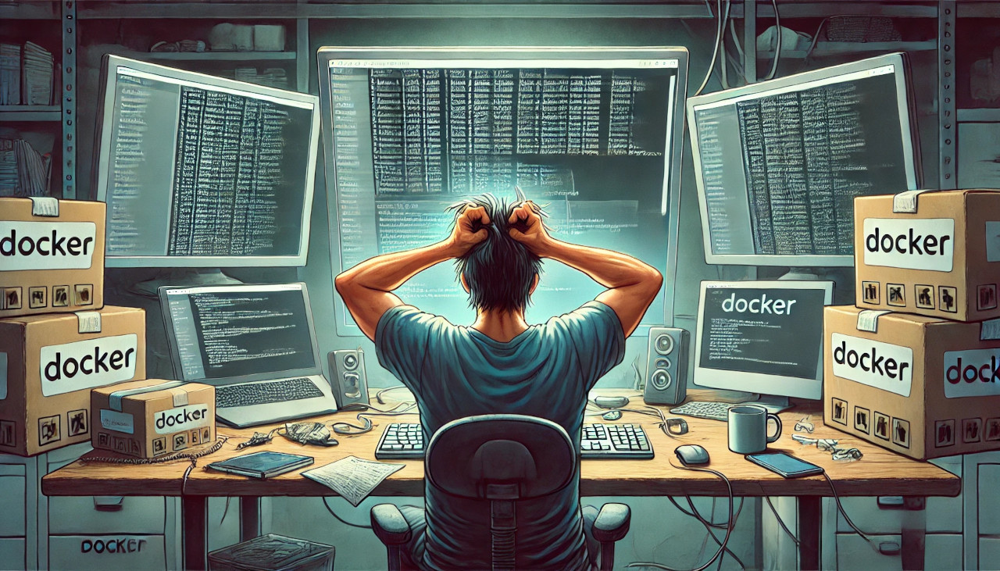

# How to Use Docker


This guide provides detailed instructions on using Docker, including commands and solutions to common problems. For installation instructions, please go the official Docker documentation at [docker.com](https://www.docker.com).

## Table of Contents

1. [Docker Group Permissions](#docker-group-permissions)
2. [Basic Docker Commands](#basic-docker-commands)
    - [List all Docker containers](#list-all-docker-containers)
    - [List running Docker containers](#list-running-docker-containers)
    - [Start a Docker container](#start-a-docker-container)
    - [Stop a Docker container](#stop-a-docker-container)
    - [Remove a Docker container](#remove-a-docker-container)
    - [Force remove a Docker container](#force-remove-a-docker-container)
    - [View logs of a Docker container](#view-logs-of-a-docker-container)
    - [Execute a command in a running container](#execute-a-command-in-a-running-container)
3. [Managing Containers](#managing-containers)
    - [Stop and remove all containers](#stop-and-remove-all-containers)
    - [Check which process is using a port](#check-which-process-is-using-a-port)
    - [Restart Docker service](#restart-docker-service)
    - [Explicitly stop and remove containers](#explicitly-stop-and-remove-containers)
    - [Start Docker daemon in debug mode](#start-docker-daemon-in-debug-mode)
    - [Verify Docker group membership](#verify-docker-group-membership)
    - [Reinstall Docker](#reinstall-docker)
    - [Check Docker logs for issues](#check-docker-logs-for-issues)
4. [Accessing Containers](#accessing-containers)
    - [Access a running container](#access-a-running-container)
    - [Copy files between host and container](#copy-files-between-host-and-container)
5. [Handling Container Issues](#handling-container-issues)
6. [Docker-Compose](#docker-compose)
    - [Docker-Compose file example](#docker-compose-file-example)
    - [Start Docker-Compose](#start-docker-compose)
    - [Check Docker-Compose service status](#check-docker-compose-service-status)
    - [Stop Docker-Compose services](#stop-docker-compose-services)
7. [Backup and Restore](#backup-and-restore)
    - [Backup MySQL/MariaDB database](#backup-mysqlmariadb-database)
    - [Restore MySQL/MariaDB database](#restore-mysqlmariadb-database)
    - [Backup website files](#backup-website-files)
    - [Restore website files](#restore-website-files)
8. [Security Best Practices](#security-best-practices)
    - [Regular Updates](#regular-updates)
    - [Setup Firewall](#setup-firewall)
    - [Use SSH Keys](#use-ssh-keys)
9. [Additional Resources](#additional-resources)

## Docker Group Permissions

Ensure your user is part of the Docker group to have the necessary permissions:

```bash
sudo usermod -aG docker $USER
newgrp docker
```

## Basic Docker Commands

### List all Docker containers

```bash
docker ps -a
```

### List running Docker containers

```bash
docker ps
```

### Start a Docker container

```bash
docker start <container_id_or_name>
```

### Stop a Docker container

```bash
docker stop <container_id_or_name>
```

### Remove a Docker container

```bash
docker rm <container_id_or_name>
```

### Force remove a Docker container

```bash
docker rm -f <container_id_or_name>
```

### View logs of a Docker container

```bash
docker logs <container_id_or_name>
```

### Execute a command in a running container

```bash
docker exec -it <container_id_or_name> <command>
```

## Managing Containers

### Stop and remove all containers

```bash
sudo docker stop $(docker ps -aq)
sudo docker rm -f $(docker ps -aq)
```

### Check which process is using a port

```bash
sudo lsof -i -P -n | grep LISTEN
```

### Restart Docker service

Sometimes restarting the Docker service can help resolve permission issues:

```bash
sudo systemctl restart docker
```

### Explicitly stop and remove containers

Find the container IDs and stop and remove them individually:

```bash
sudo docker stop d0ef74920923
sudo docker rm -f d0ef74920923

sudo docker stop 24f3cfc93042
sudo docker rm -f 24f3cfc93042
```

### Start Docker daemon in debug mode

```bash
sudo dockerd --debug
```

### Verify Docker group membership

Ensure the user is in the Docker group:

```bash
groups $USER
```

### Reinstall Docker

If problems persist, consider reinstalling Docker:

```bash
sudo apt-get purge docker-ce docker-ce-cli containerd.io
sudo apt-get install docker-ce docker-ce-cli containerd.io
```

### Check Docker logs for issues

```bash
sudo journalctl -u docker.service
```

## Accessing Containers

### Access a running container

```bash
docker exec -it <container_id_or_name> /bin/bash
```

### Copy files between host and container

```bash
docker cp <source_path> <container_id_or_name>:<destination_path>
docker cp <container_id_or_name>:<source_path> <destination_path>
```

## Docker-Compose

### Docker-Compose file example

Create a `docker-compose.yml` file to define and run multi-container Docker applications:

```yaml
version: '3.8'

services:
  web:
    image: php:7.4-apache
    container_name: lamp-web
    ports:
      - "8003:80"
    volumes:
      - ./html:/var/www/html
    networks:
      - lamp-network

  db:
    image: mariadb:latest
    container_name: lamp-mariadb
    environment:
      MYSQL_ROOT_PASSWORD: example_root_password
      MYSQL_DATABASE: example_db
      MYSQL_USER: example_user
      MYSQL_PASSWORD: example_password
    command: >
      --default-authentication-plugin=mysql_native_password
      --init-file /docker-entrypoint-initdb.d/init.sql
    volumes:
      - ./mariadb_data:/var/lib/mysql
      - ./init.sql:/docker-entrypoint-initdb.d/init.sql
    networks:
      - lamp-network

  phpmyadmin:
    image: phpmyadmin/phpmyadmin
    container_name: lamp-phpmyadmin
    environment:
      PMA_HOST: lamp-mariadb
      PMA_USER: phpmyadmin_user
      PMA_PASSWORD: phpmyadmin_password
    ports:
      - "8004:80"
    networks:
      - lamp-network

networks:
  lamp-network:
    driver: bridge
```

### Start Docker-Compose

Navigate to the directory containing your `docker-compose.yml` file and start the services:

```bash
cd /path/to/your/docker-compose/directory
docker-compose up -d
```

### Check Docker-Compose service status

```bash
docker-compose ps
```

### Stop Docker-Compose services

```bash
docker-compose down
```

## Backup and Restore

### Backup MySQL/MariaDB database

```bash
docker exec lamp-mariadb /usr/bin/mysqldump -u example_user --password=example_password example_db > backup.sql
```

### Restore MySQL/MariaDB database

```bash
cat backup.sql | docker exec -i lamp-mariadb /usr/bin/mysql -u example_user --password=example_password example_db
```

### Backup website files

```bash
tar czvf backup-html.tar.gz -C /path/to/your/html/files .
```

### Restore website files

```bash
tar xzvf backup-html.tar.gz -C /path/to/your/html/files
```

## Security Best Practices

### Regular Updates

Keep your system and Docker images updated regularly:

```bash
sudo apt-get update && sudo apt-get upgrade
docker pull php:7.4-apache
docker pull mariadb:latest
docker pull phpmyadmin/phpmyadmin
```

### Setup Firewall

Use `ufw` (Uncomplicated Firewall) to restrict access to specific ports:

```bash
sudo ufw allow OpenSSH
sudo ufw allow 8003
sudo ufw allow 8004
sudo ufw enable
```

### Use SSH Keys

Avoid using password authentication and use SSH keys instead.

## Additional Resources

For more detailed information, go to the official Docker documentation at [docker.com](https://www.docker.com).

## Your Support
If you find this project useful and want to support it, there are several ways to do so:

- If you find the white paper helpful, please ⭐ it on GitHub. This helps make the project more visible and reach more people.
- Become a Follower: If you're interested in updates and future improvements, please follow my GitHub account. This way you'll always stay up-to-date.
- Learn more about my work: I invite you to check out all of my work on GitHub and visit my developer site https://volkansah.github.io. Here you will find detailed information about me and my projects.
- Share the project: If you know someone who could benefit from this project, please share it. The more people who can use it, the better.
**If you appreciate my work and would like to support it, please visit my [GitHub Sponsor page](https://github.com/sponsors/volkansah). Any type of support is warmly welcomed and helps me to further improve and expand my work.**

Thank you for your support! ❤️

##### Copyright S. Volkan Kücükbudak
